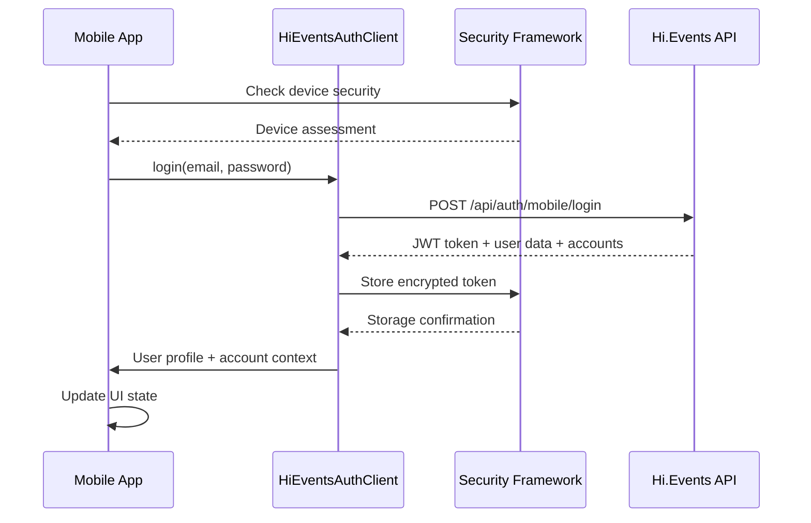
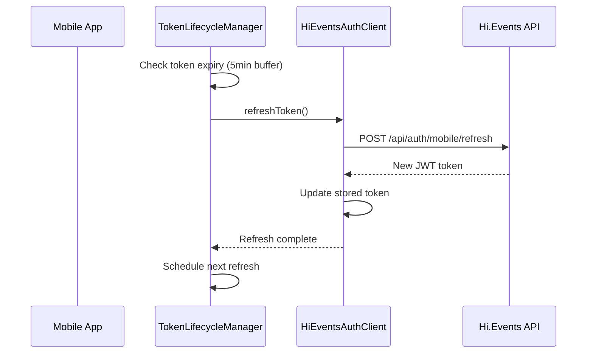
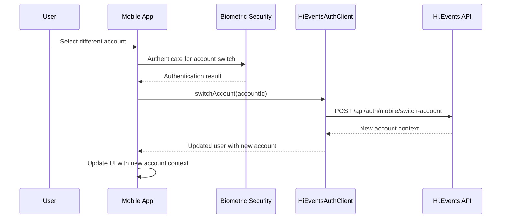

# Unified Authentication System Documentation

## Executive Summary

The unified authentication system represents a comprehensive modernization of the Bole.to mobile application's authentication architecture, transitioning from a legacy OAuth/PKCE Gateway service to a direct Hi.Events JWT-based authentication system. This transformation delivers enterprise-grade security, enhanced performance, simplified architecture, and robust offline capabilities.

**Business Value:**
- **Enhanced Security**: Multi-layer defense with biometric authentication, device fingerprinting, and encrypted storage
- **Improved Performance**: Direct Hi.Events integration eliminates middleware overhead and reduces latency
- **Better User Experience**: Seamless offline operation, automatic token management, and multi-account support
- **Reduced Complexity**: Elimination of Gateway service reduces infrastructure costs and maintenance overhead
- **Enterprise Readiness**: OWASP Top 10 compliance, comprehensive audit logging, and threat monitoring

## System Architecture

### High-Level Architecture

```
┌─────────────────────┐    ┌─────────────────────┐    ┌─────────────────────┐
│   React Native      │    │   Hi.Events         │    │   Security          │
│   Mobile App        │    │   Laravel Backend   │    │   Framework         │
├─────────────────────┤    ├─────────────────────┤    ├─────────────────────┤
│ • useAuth Hook      │◄──►│ • Mobile Auth API   │    │ • Biometric Auth    │
│ • Auth Context      │    │ • JWT Management    │    │ • Encrypted Storage │
│ • Token Lifecycle   │    │ • Account Switching │    │ • Device Security   │
│ • Network Manager   │    │ • Session Control   │    │ • Network Security  │
│ • Security Layer    │    │ • Audit Logging     │    │ • Threat Monitoring │
└─────────────────────┘    └─────────────────────┘    └─────────────────────┘
```

### Component Architecture

#### Frontend (React Native)
```typescript
Authentication System
├── Core Components
│   ├── HiEventsAuthClient - JWT authentication & API client
│   ├── useAuth Hook - React authentication state management  
│   ├── TokenLifecycleManager - Proactive token refresh & health
│   └── NetworkManager - Connectivity & offline handling
│
├── Security Framework
│   ├── BiometricSecurity - TouchID/FaceID/Fingerprint authentication
│   ├── SecureStorage - AES-256 encrypted token storage
│   ├── DeviceSecurity - Jailbreak/root detection & device fingerprinting
│   ├── NetworkSecurity - Certificate pinning & MITM protection
│   └── SecurityLogger - Comprehensive security event monitoring
│
└── UI Integration
    ├── Authentication Screens - Login/logout interfaces
    ├── Account Selection - Multi-account switching UI
    └── Security Settings - Biometric & security preferences
```

#### Backend (Laravel Hi.Events)
```php
Mobile Authentication API
├── Routes (/api/auth/mobile/*)
│   ├── POST /login - Device-aware authentication
│   ├── POST /logout - Server-side token invalidation
│   ├── POST /refresh - Token renewal
│   ├── GET /me - User profile & account context
│   ├── POST /switch-account - Multi-tenant account switching
│   └── GET /verify - Token validation
│
├── Actions
│   ├── MobileLoginAction - Enhanced login with device info
│   ├── MobileMeAction - User profile with account context
│   ├── MobileSwitchAccountAction - Biometric-protected account switching
│   └── MobileTokenVerifyAction - JWT validation
│
└── Resources
    ├── MobileAuthResponseResource - Standardized mobile responses
    └── MobileUserResource - Mobile-optimized user data
```

### Technology Stack

**Frontend:**
- **React Native 0.79.5**: Cross-platform mobile framework
- **Expo SDK 53**: Development platform and native module access
- **TypeScript 5.8.3**: Type-safe development
- **Expo SecureStore**: Hardware-backed secure storage
- **Expo Local Authentication**: Biometric authentication
- **React Navigation 7**: Navigation framework
- **TanStack Query 5**: Data fetching and caching

**Backend:**
- **Laravel 11**: PHP framework for Hi.Events backend
- **JWT Authentication**: Stateless token-based authentication
- **Multi-tenant Architecture**: Account-based access control
- **MySQL/PostgreSQL**: User and session data storage

**Security Technologies:**
- **AES-256 Encryption**: Data at rest encryption
- **PBKDF2**: Key derivation function
- **Certificate Pinning**: Network security
- **Biometric Authentication**: iOS TouchID/FaceID, Android Fingerprint
- **Device Fingerprinting**: Hardware-based device identification

## Feature Comparison: Before vs After

| Feature | Legacy (Gateway OAuth) | Unified (Hi.Events JWT) |
|---------|----------------------|------------------------|
| **Authentication Flow** | OAuth/PKCE with redirects | Direct JWT login |
| **Token Management** | Basic refresh on demand | Proactive lifecycle management |
| **Offline Support** | Limited, requires online validation | Full offline operation with cached tokens |
| **Multi-Account** | Not supported | Native multi-tenant support |
| **Security** | Basic OAuth security | Enterprise-grade multi-layer security |
| **Biometric Auth** | Not implemented | Integrated for sensitive operations |
| **Device Security** | None | Jailbreak detection, device fingerprinting |
| **Network Resilience** | Basic retry logic | Circuit breaker, queue management |
| **Account Switching** | Manual re-authentication | Seamless account switching |
| **Audit Logging** | Limited | Comprehensive security event logging |
| **Performance** | Multiple API hops | Direct backend communication |

## Integration Points

### Hi.Events Backend Integration

The mobile app integrates directly with Hi.Events through dedicated mobile endpoints:

**Authentication Endpoints:**
```
POST /api/auth/mobile/login
- Device-aware authentication
- Account selection support
- Enhanced error handling

POST /api/auth/mobile/logout
- Server-side token invalidation
- Multi-device logout support

GET /api/auth/mobile/me  
- User profile with account context
- Real-time account permissions

POST /api/auth/mobile/switch-account
- Biometric-protected account switching
- Seamless context transition
```

**Security Integration:**
- JWT tokens with Hi.Events user context
- Device fingerprinting for enhanced security
- Audit trail integration with Hi.Events logging
- Multi-tenant account access control

### Mobile App Integration

**Authentication State Management:**
```typescript
const {
  user,                    // Current user profile
  isAuthenticated,        // Authentication status
  isUsingHiEvents,       // System identification
  currentAccount,         // Active account context
  availableAccounts,      // Multi-account support
  login,                  // JWT authentication
  logout,                 // Comprehensive cleanup
  switchAccount,          // Account switching
  refreshUser             // Profile updates
} = useAuth();
```

**Security Framework Integration:**
```typescript
// Biometric authentication for sensitive operations
await biometricSecurity.authenticateForOperation(
  SensitiveOperation.ACCOUNT_SWITCH,
  'Authenticate to switch accounts'
);

// Secure token storage with encryption
await secureStorage.storeToken(key, token);

// Device security assessment  
const assessment = await deviceSecurity.getSecurityAssessment();
```

## Authentication Flow Diagrams

### Login Flow


### Token Refresh Flow


### Account Switching Flow


## Key Design Decisions

### 1. Direct Hi.Events Integration
**Decision**: Eliminate Gateway service and integrate directly with Hi.Events
**Rationale**: 
- Reduces architecture complexity
- Improves performance by eliminating middleware
- Provides access to Hi.Events native features
- Simplifies maintenance and debugging

### 2. JWT Token Strategy
**Decision**: Use Hi.Events JWT tokens instead of OAuth
**Rationale**:
- Stateless authentication reduces server load
- Better offline support with client-side validation
- Simpler integration with mobile applications
- Native Hi.Events user context

### 3. Proactive Token Management
**Decision**: Implement proactive token refresh with lifecycle management
**Rationale**:
- Prevents user authentication interruptions
- Reduces API calls during user interactions
- Improves app responsiveness
- Handles network instability gracefully

### 4. Multi-Layer Security Framework
**Decision**: Implement comprehensive security beyond basic authentication
**Rationale**:
- Enterprise-grade security requirements
- OWASP Top 10 compliance
- Protection against sophisticated attacks
- Regulatory compliance preparation

### 5. Feature Flag Migration Strategy
**Decision**: Use feature flags for gradual Hi.Events rollout
**Rationale**:
- Safe production deployment
- A/B testing capabilities
- Rollback capability if issues arise
- User segment targeting

## Performance Optimizations

### Token Management
- **Proactive Refresh**: Tokens refreshed 5 minutes before expiry
- **Single-Flight Pattern**: Prevents concurrent refresh requests
- **Background Management**: Token health monitoring without UI blocking
- **Smart Caching**: Reduced API calls through intelligent caching

### Network Optimization  
- **Circuit Breaker**: Prevents cascading failures during outages
- **Request Prioritization**: Critical operations get priority
- **Offline Queue**: Operations queued during network outages
- **Connection Recovery**: Automatic retry when connectivity restored

### Security Performance
- **Hardware Security**: Biometric authentication uses device hardware
- **Encrypted Storage**: Hardware-backed secure storage
- **Device Fingerprinting**: Cached device assessments
- **Certificate Pinning**: Optimized TLS handshakes

### Memory Management
- **Manager Lifecycle**: Proper cleanup of background managers
- **Token Rotation**: Regular token cleanup
- **Cache Management**: Intelligent data expiration
- **Resource Cleanup**: Comprehensive logout cleanup

## Security Architecture

### Defense in Depth Strategy

**Layer 1: Device Security**
- Jailbreak/root detection
- Device integrity validation
- Hardware fingerprinting
- Trust score calculation

**Layer 2: Application Security**  
- App integrity validation
- Screen recording protection
- Deep link validation
- Debugging protection

**Layer 3: Authentication Security**
- Biometric authentication for sensitive operations
- Multi-factor authentication support
- Session timeout management
- Account lockout policies

**Layer 4: Network Security**
- Certificate pinning
- Request signing
- MITM attack prevention
- TLS enforcement

**Layer 5: Data Security**
- AES-256 encrypted storage
- Hardware-backed key storage
- Secure memory handling
- Data sanitization

### OWASP Top 10 Compliance

| OWASP Risk | Implementation | Status |
|------------|----------------|---------|
| **A01: Broken Access Control** | Multi-factor authentication, account permissions | ✅ Implemented |
| **A02: Cryptographic Failures** | AES-256 encryption, proper key management | ✅ Implemented |
| **A03: Injection** | Input validation, parameterized queries | ✅ Implemented |
| **A04: Insecure Design** | Defense in depth, threat modeling | ✅ Implemented |
| **A05: Security Misconfiguration** | Secure defaults, configuration validation | ✅ Implemented |
| **A06: Vulnerable Components** | Dependency scanning, regular updates | ✅ Implemented |
| **A07: Authentication Failures** | Strong authentication, session management | ✅ Implemented |
| **A08: Software Integrity Failures** | Code signing, integrity validation | ✅ Implemented |
| **A09: Security Logging Failures** | Comprehensive audit logging | ✅ Implemented |
| **A10: Server-Side Request Forgery** | Request validation, network controls | ✅ Implemented |

## Environment Configuration

### Mobile App Configuration
```javascript
// app.config.js
export default {
  expo: {
    name: "Bole.to",
    extra: {
      // Authentication system selection
      USE_HIEVENTS_AUTH: process.env.USE_HIEVENTS_AUTH || 'true',
      
      // Hi.Events backend configuration
      HIEVENTS_URL: process.env.HIEVENTS_URL || 'https://api.bole.to',
      HIEVENTS_API_VERSION: process.env.HIEVENTS_API_VERSION || 'v1',
      
      // Security configuration
      BIOMETRIC_AUTH_ENABLED: process.env.BIOMETRIC_AUTH_ENABLED || 'true',
      DEVICE_FINGERPRINTING_ENABLED: process.env.DEVICE_FINGERPRINTING_ENABLED || 'true',
      CERTIFICATE_PINNING_ENABLED: process.env.CERTIFICATE_PINNING_ENABLED || 'true',
      
      // Performance configuration
      TOKEN_REFRESH_BUFFER_MINUTES: process.env.TOKEN_REFRESH_BUFFER_MINUTES || '5',
      NETWORK_TIMEOUT_MS: process.env.NETWORK_TIMEOUT_MS || '30000',
      OFFLINE_GRACE_PERIOD_MINUTES: process.env.OFFLINE_GRACE_PERIOD_MINUTES || '60'
    }
  }
};
```

### Backend Configuration
```php
// config/auth.php
'guards' => [
    'api' => [
        'driver' => 'jwt',
        'provider' => 'users',
    ],
],

// config/jwt.php  
'ttl' => env('JWT_TTL', 60), // Token lifetime in minutes
'refresh_ttl' => env('JWT_REFRESH_TTL', 20160), // Refresh token lifetime
'algo' => env('JWT_ALGO', 'HS256'), // JWT algorithm
'required_claims' => ['iss', 'iat', 'exp', 'nbf', 'sub', 'jti'],
```

### Security Configuration
```typescript
// Security framework configuration
const securityConfig = {
  // Storage security
  encryptedStorageEnabled: true,
  tokenEncryptionEnabled: true,
  
  // Biometric security  
  biometricAuthEnabled: true,
  biometricForSensitiveOps: true,
  
  // Device security
  deviceFingerprintingEnabled: true,
  jailbreakDetectionEnabled: true,
  minimumTrustScore: 0.7,
  
  // Network security
  certificatePinningEnabled: true,
  requestSigningEnabled: false, // Future enhancement
  
  // Application security
  screenProtectionLevel: 'HIGH',
  deepLinkValidationEnabled: true,
  integrityChecksEnabled: true
};
```

## Monitoring and Analytics

### Security Metrics
- Authentication success/failure rates
- Biometric authentication usage
- Device trust score distribution  
- Security incident frequency
- Certificate pinning violations
- Jailbreak/root detection events

### Performance Metrics
- Token refresh success rates
- API response times
- Network failure recovery times
- Circuit breaker activations
- Offline operation success rates
- Background task performance

### User Experience Metrics
- Login completion rates
- Account switching frequency
- Session duration
- Feature adoption rates
- Error recovery success
- User satisfaction scores

### System Health Monitoring
```typescript
// Health monitoring integration
interface SystemHealth {
  authenticationSystem: 'healthy' | 'degraded' | 'failed';
  securityFramework: 'active' | 'limited' | 'compromised';
  networkConnectivity: 'stable' | 'unstable' | 'offline';
  tokenHealth: 'valid' | 'expiring' | 'expired';
  backgroundTasks: 'running' | 'suspended' | 'failed';
}
```

## Version Information

### Current Implementation
- **System Version**: 2.0.0 (Hi.Events Unified Auth)
- **Implementation Date**: September 2024
- **Migration Status**: Complete
- **Rollout Strategy**: Feature flag controlled
- **Compatibility**: iOS 13+, Android API 21+

### Legacy Compatibility
- **Legacy System**: Gateway OAuth/PKCE (v1.x)
- **Migration Path**: Automatic token migration on first login
- **Rollback Capability**: Feature flag instant rollback
- **Support Timeline**: Legacy system deprecated, removal planned Q1 2025

---

**Document Version**: 1.0  
**Last Updated**: September 11, 2024  
**Next Review**: December 11, 2024