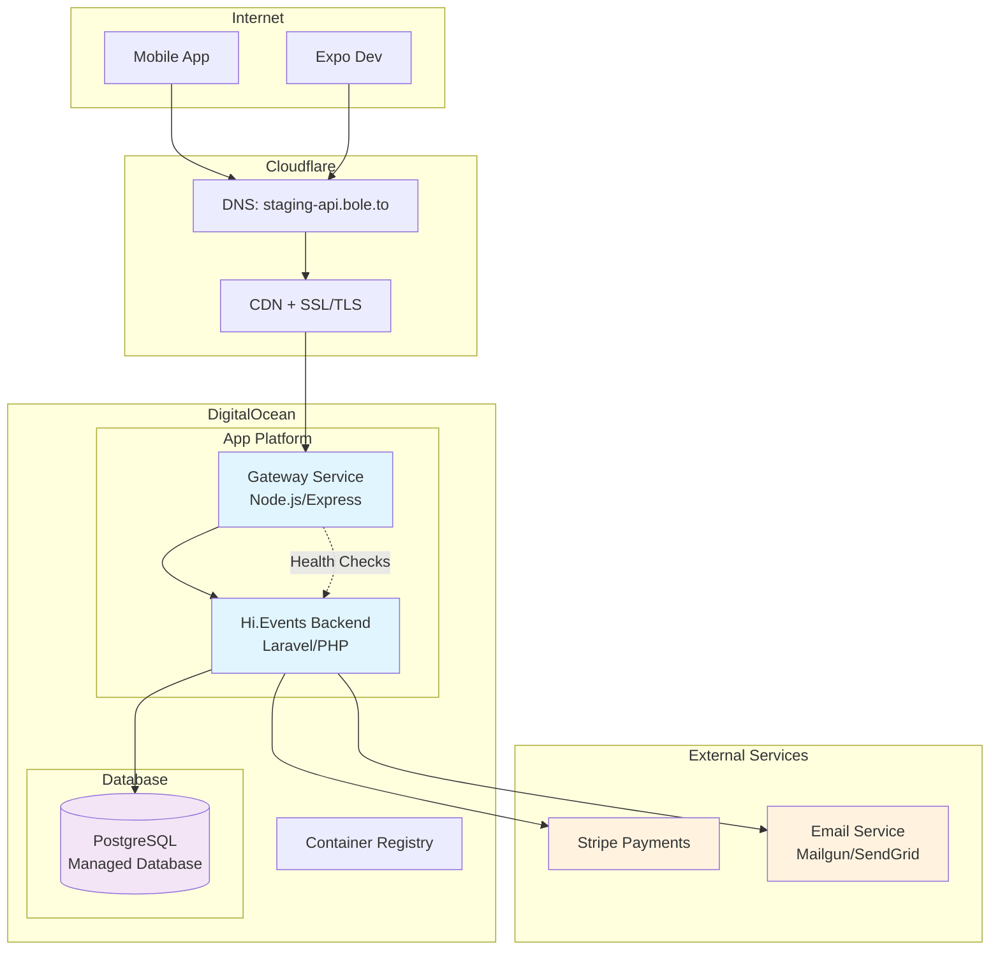

# Bole.to MVP Infrastructure Setup Guide

This guide covers the complete infrastructure setup for the Bole.to MVP, including the Gateway service, Hi.Events backend, and staging environment deployment.

## Architecture Overview



## Components

### 1. Gateway Service (`apps/gateway/`)

**Purpose**: Lightweight reverse proxy that forwards requests to Hi.Events backend while providing CORS, logging, and security features.

**Key Features**:
- Path-preserving request forwarding
- CORS configuration for Expo development environments
- Request logging with unique request IDs
- Security headers via Helmet.js
- Health check endpoints
- Unified error handling

**Technology Stack**:
- Node.js 18+
- Express.js
- http-proxy-middleware
- Helmet.js for security
- Morgan for logging

### 2. Hi.Events Backend (`services/hi-events/`)

**Purpose**: Complete Laravel-based event management system with JWT authentication, event management, orders, and Stripe integration.

**Key Features**:
- JWT-based authentication
- Event management (CRUD)
- Order processing with Stripe
- User management and invitations
- File uploads and image management
- Email notifications
- Webhook support

**Technology Stack**:
- PHP 8.2+
- Laravel framework
- PostgreSQL database
- JWT authentication
- Stripe payment integration

### 3. Infrastructure Components

**DigitalOcean App Platform**:
- Managed container hosting
- Automatic deployments from Git
- Built-in load balancing
- SSL certificate management
- Environment variable management

**Managed PostgreSQL**:
- Automated backups
- High availability options
- Connection pooling
- Performance monitoring

**Cloudflare**:
- DNS management
- SSL/TLS termination
- CDN and caching
- DDoS protection
- Security features

## Deployment Guide

### Prerequisites

1. **Accounts Required**:
   - DigitalOcean account
   - Cloudflare account (domain must be managed by Cloudflare)
   - GitHub account
   - Stripe account (for payments)
   - Email service account (Mailgun, SendGrid, or Gmail)

2. **Tools Required**:
   - Terraform >= 1.0
   - Node.js >= 18
   - PHP >= 8.2
   - Composer
   - Git

### Step 1: Repository Setup

1. Clone the repository:
   ```bash
   git clone https://github.com/your-org/bole-to.git
   cd bole-to
   ```

2. Ensure you're on the correct branch:
   ```bash
   git checkout develop
   ```

### Step 2: Configure Environment Variables

Run the setup helper script:
```bash
./infra/scripts/setup-secrets.sh
```

This script will:
- Generate Laravel app key and JWT secret
- Create `terraform.tfvars` template
- Show GitHub secrets setup guide
- Display cost estimation

### Step 3: Manual Deployment

1. **Configure Terraform Variables**:
   ```bash
   cd infra/terraform/staging
   cp terraform.tfvars.example terraform.tfvars
   # Edit terraform.tfvars with your values
   ```

2. **Deploy Infrastructure**:
   ```bash
   ./infra/scripts/deploy-staging.sh
   ```

3. **Verify Deployment**:
   ```bash
   ./infra/scripts/deploy-staging.sh --validate
   ```

### Step 4: GitHub Actions Deployment (Recommended)

1. **Configure GitHub Secrets**:
   Go to your repository → Settings → Secrets and variables → Actions

   Add the following secrets:
   - `DIGITALOCEAN_TOKEN`
   - `CLOUDFLARE_API_TOKEN`
   - `LARAVEL_APP_KEY`
   - `JWT_SECRET`
   - `STRIPE_PUBLIC_KEY_TEST`
   - `STRIPE_SECRET_KEY_TEST`
   - `MAIL_HOST`
   - `MAIL_PORT`
   - `MAIL_USERNAME`
   - `MAIL_PASSWORD`

2. **Trigger Deployment**:
   - Push to `develop` branch, or
   - Manually trigger via GitHub Actions tab

## Configuration Details

### Environment Variables

#### Gateway Service
```env
NODE_ENV=production
PORT=8080
HIEVENTS_BACKEND_URL=https://your-hievents-app.ondigitalocean.app
CORS_ORIGINS=exp://localhost:*,https://staging-api.bole.to
REQUEST_TIMEOUT=30000
```

#### Hi.Events Backend
```env
APP_ENV=production
APP_DEBUG=false
APP_KEY=base64:your_generated_key
JWT_SECRET=your_jwt_secret
DB_HOST=your_database_host
DB_PORT=25060
DB_DATABASE=hievents_staging
DB_USERNAME=hievents_user
DB_PASSWORD=your_database_password
STRIPE_PUBLIC_KEY=pk_test_your_stripe_key
STRIPE_SECRET_KEY=sk_test_your_stripe_secret
```

### DNS Configuration

The Terraform configuration automatically creates:
- DNS record: `staging-api.bole.to` → Gateway service
- SSL certificate via Cloudflare
- CDN and security features enabled

### Database Configuration

- **Engine**: PostgreSQL 15
- **Size**: `db-s-1vcpu-1gb` (staging)
- **Database**: `hievents_staging`
- **User**: `hievents_user` (auto-generated password)
- **Backups**: Automated daily backups
- **Connections**: Connection pooling enabled

## Health Monitoring

### Health Check Endpoints

1. **Gateway Health**:
   ```
   GET https://staging-api.bole.to/healthz
   ```
   Returns gateway status and system information.

2. **Deep Health Check**:
   ```
   GET https://staging-api.bole.to/healthz?deep=true
   ```
   Includes backend connectivity check.

3. **Hi.Events Health**:
   ```
   GET https://staging-api.bole.to/api/public/color-themes
   ```
   Tests Hi.Events backend functionality.

### Monitoring Strategy

- **Health Checks**: Automated every 30 seconds
- **Uptime Monitoring**: Use external services (UptimeRobot, Pingdom)
- **Logs**: Access via DigitalOcean App Platform console
- **Alerts**: Configure via DigitalOcean monitoring

## Cost Optimization

### Monthly Cost Breakdown (Staging)

| Service | Size | Cost | Notes |
|---------|------|------|-------|
| PostgreSQL | `db-s-1vcpu-1gb` | $15 | Includes backups |
| Gateway App | `basic-xxs` | $5 | 512MB RAM, 1 vCPU |
| Hi.Events App | `basic-xxs` | $5 | 512MB RAM, 1 vCPU |
| Container Registry | Basic | $0 | Free tier |
| Cloudflare | Free features | $0 | SSL, CDN, DNS |
| Data Transfer | Estimated | $1-2 | Based on usage |
| **Total** | | **~$26-27** | |

### Cost Optimization Tips

1. **Right-sizing**: Start with smallest instances, scale up as needed
2. **Database**: Use connection pooling to maximize efficiency
3. **CDN**: Cloudflare caching reduces bandwidth costs
4. **Monitoring**: Set up billing alerts in DigitalOcean
5. **Cleanup**: Remove unused resources regularly

## Security Configuration

### Network Security
- All traffic encrypted via HTTPS/TLS 1.3
- Cloudflare DDoS protection
- HSTS headers enforced
- CORS properly configured for mobile apps

### Application Security
- JWT tokens for authentication
- Helmet.js security headers
- Input validation via Laravel
- SQL injection protection via Eloquent ORM
- CSRF protection enabled

### Secrets Management
- Environment variables stored securely in App Platform
- No secrets in repository code
- Database passwords auto-generated
- API keys managed via platform secrets

## Troubleshooting

### Common Issues

1. **Deployment Fails**:
   - Check all required secrets are configured
   - Verify API tokens have correct permissions
   - Ensure domain is added to Cloudflare

2. **Health Checks Fail**:
   - Wait 60-90 seconds for services to start
   - Check logs in DigitalOcean console
   - Verify database connectivity

3. **CORS Errors**:
   - Update `CORS_ORIGINS` environment variable
   - Check Expo development domain patterns
   - Verify mobile app is using correct API URL

4. **Database Connection Issues**:
   - Check database cluster is running
   - Verify connection string format
   - Ensure database user has correct permissions

### Debug Commands

```bash
# Check Terraform state
cd infra/terraform/staging
terraform show

# View deployment logs
doctl apps logs <app-id> --follow

# Test endpoints
curl -v https://staging-api.bole.to/healthz
curl -v https://staging-api.bole.to/api/public/color-themes
```

## Scaling Considerations

### Horizontal Scaling
- Increase instance count in Terraform configuration
- App Platform load balancer automatically distributes traffic
- Database connection pooling handles multiple app instances

### Vertical Scaling
- Upgrade instance sizes via Terraform variables
- Database can be resized with minimal downtime
- Monitor resource usage to determine scaling needs

### Performance Optimization
- Enable Cloudflare caching for static assets
- Use database indexes for frequently queried data
- Implement API response caching where appropriate
- Consider CDN for user-uploaded images

## Migration to Production

### Production Differences
1. **Infrastructure**:
   - Larger database instances (`db-s-2vcpu-4gb` minimum)
   - Professional App Platform instances
   - Multi-region deployment consideration
   - Redis for caching and sessions

2. **Security**:
   - Enable database encryption at rest
   - Use Cloudflare WAF (Web Application Firewall)
   - Implement rate limiting
   - Set up monitoring and alerting

3. **Monitoring**:
   - APM tools (New Relic, DataDog)
   - Log aggregation (ELK stack, Splunk)
   - Error tracking (Sentry, Bugsnag)
   - Performance monitoring

## Support and Maintenance

### Backup Strategy
- Database: Automated daily backups (7-day retention)
- Application: Git repository serves as backup
- Configuration: Terraform state stored remotely

### Update Process
1. Test changes in staging environment
2. Review Terraform plan before applying
3. Deploy during low-traffic periods
4. Monitor health checks after deployment
5. Have rollback plan ready

### Contact Information
- **Infrastructure Team**: [your-team@bole.to]
- **On-call**: [emergency contact]
- **Documentation**: [internal wiki link]

---

*Last updated: 2025-01-20*
*Environment: Staging*
*Version: MVP Phase 1*