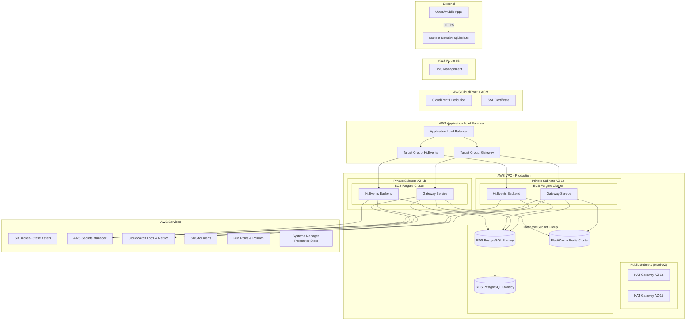

# Bole.to Production Infrastructure Architecture

## Overview

This document outlines the production infrastructure architecture for the Bole.to event ticketing platform, designed for high availability, scalability, security, and cost optimization.

## Architecture Diagram

## Core Components

### 1. Networking & Security Layer

**AWS VPC Configuration:**
- Multi-AZ deployment across us-east-1a and us-east-1b
- Private subnets for application tier
- Public subnets for NAT gateways and load balancers
- Network ACLs and Security Groups for defense in depth
- VPC Flow Logs enabled for security monitoring

**Security Groups:**
- ALB Security Group: 80, 443 from internet
- ECS Security Group: 3001, 8000 from ALB only
- RDS Security Group: 5432 from ECS only
- Redis Security Group: 6379 from ECS only

### 2. Load Balancing & SSL Termination

**Application Load Balancer:**
- SSL termination with ACM certificates
- Path-based routing:
  - `/auth/*`, `/me`, `/healthz`, `/.well-known/*` → Gateway Service
  - `/api/*` → Hi.Events Backend (via Gateway proxy)
- Health checks configured for both services
- Sticky sessions for OAuth flows

**CloudFront CDN:**
- Global edge locations for reduced latency
- Caching static assets from S3
- Security headers and DDoS protection
- Custom domain: api.bole.to

### 3. Container Orchestration

**ECS Fargate:**
- Serverless container hosting
- Auto-scaling based on CPU and memory
- Service discovery for inter-service communication
- Blue/green deployments

**Gateway Service Configuration:**
- 2-4 tasks (auto-scaling)
- 1 vCPU, 2GB RAM per task
- Health check endpoint: `/healthz`
- Environment variables from Parameter Store and Secrets Manager

**Hi.Events Backend Configuration:**
- 2-6 tasks (auto-scaling)
- 2 vCPU, 4GB RAM per task
- Health check endpoint: `/api/health`
- Shared storage via EFS if needed

### 4. Database Layer

**Amazon RDS PostgreSQL:**
- Multi-AZ deployment for high availability
- db.t3.medium instance (2 vCPU, 4GB RAM) - scalable
- Automated backups with 7-day retention
- Point-in-time recovery enabled
- Encryption at rest with KMS
- Connection pooling via RDS Proxy

**ElastiCache Redis:**
- Cluster mode for session storage
- cache.t3.micro instances (2 nodes)
- Automatic failover enabled
- Encryption in transit and at rest

### 5. Storage

**S3 Buckets:**
- Static assets bucket with CloudFront distribution
- Application logs and backups
- Cross-region replication for disaster recovery
- Lifecycle policies for cost optimization

**EFS (if needed):**
- Shared file system for Hi.Events uploads
- Regional, multi-AZ storage

## Estimated Monthly Costs (USD)

### Compute & Networking
- ECS Fargate (Gateway): ~$50-80/month
- ECS Fargate (Hi.Events): ~$100-150/month
- Application Load Balancer: ~$22/month
- NAT Gateways (2): ~$90/month
- CloudFront: ~$10-20/month

### Database & Cache
- RDS PostgreSQL (Multi-AZ): ~$120-150/month
- ElastiCache Redis: ~$30-40/month
- RDS Proxy: ~$15/month

### Storage & Other Services
- S3 Storage: ~$10-20/month
- CloudWatch Logs & Metrics: ~$20-30/month
- Route 53: ~$1/month
- Secrets Manager: ~$5/month
- ACM Certificate: Free

**Total Estimated Cost: $473-633/month**

## Security Considerations

### Network Security
- All resources in private subnets except load balancers
- WAF rules for common attack patterns
- VPC Flow Logs for network monitoring
- Security groups with least privilege access

### Application Security
- Secrets stored in AWS Secrets Manager
- Environment variables in Parameter Store
- IAM roles with minimal permissions
- Regular security updates via automated deployments

### Data Protection
- Database encryption at rest and in transit
- S3 bucket encryption and versioning
- Redis cluster encryption
- Backup encryption

### Compliance
- GDPR compliance for user data
- PCI DSS considerations for payment processing
- SOC 2 Type II readiness
- Regular security audits and penetration testing

## High Availability & Disaster Recovery

### Availability Strategy
- Multi-AZ deployment across 2 availability zones
- Auto Scaling Groups for compute resources
- RDS Multi-AZ with automatic failover
- ElastiCache with replica nodes

### Backup Strategy
- RDS automated backups (7 days retention)
- Point-in-time recovery for databases
- S3 cross-region replication
- Application-level backup procedures

### Recovery Objectives
- RTO (Recovery Time Objective): 15 minutes
- RPO (Recovery Point Objective): 5 minutes
- Disaster recovery runbooks documented
- Regular DR testing procedures

## Monitoring & Alerting

### CloudWatch Metrics
- Application performance metrics
- Database performance metrics
- Load balancer metrics
- Cost optimization alerts

### Logging
- Centralized logging via CloudWatch Logs
- Application logs from ECS containers
- Load balancer access logs
- VPC Flow Logs

### Alerting Channels
- Critical alerts via PagerDuty integration
- Email notifications for warnings
- Slack integration for team notifications
- Weekly infrastructure health reports

## Scaling Strategy

### Horizontal Scaling
- ECS Service auto-scaling based on CPU/memory
- Database read replicas for read-heavy workloads
- CloudFront edge caching for global performance

### Vertical Scaling
- RDS instance size scaling during maintenance windows
- ECS task definition updates for resource allocation
- Load testing to determine optimal configurations

### Cost Optimization
- Reserved Instances for predictable workloads
- Spot Instances for non-critical tasks
- S3 Intelligent Tiering for storage cost optimization
- Regular cost reviews and right-sizing exercises

## Next Steps

1. **Infrastructure Provisioning**: Deploy Terraform configurations
2. **Application Deployment**: Container image builds and ECS deployment
3. **DNS Configuration**: Route 53 setup and SSL certificate validation
4. **Monitoring Setup**: CloudWatch dashboards and alerting rules
5. **Security Hardening**: WAF rules and security group refinement
6. **Performance Testing**: Load testing and optimization
7. **Documentation**: Operations runbooks and incident response procedures